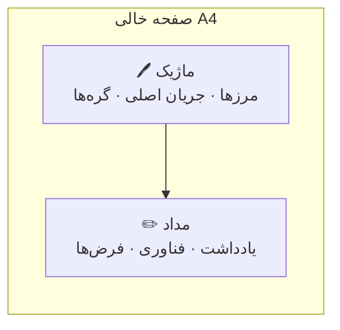
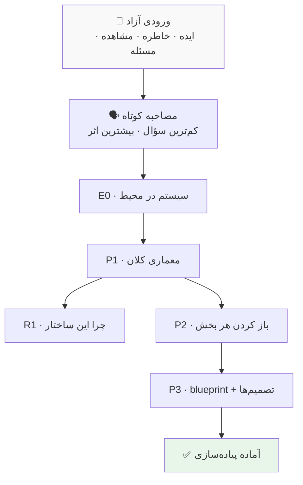

# Dream Print

**ایده‌ی مبهم، خاطره‌ی پروژه، یا مسئله‌ی فنی → معماری منسجم روی کاغذ**

Open-source Agent Skill · نسخه 0.1.0 · [MIT](dreamprint/LICENSE)

---

## چرا؟

اغلب ایده‌ای داری که «می‌دانی درست است»، ولی هنوز شکل نگرفته. یا پروژه‌ای که انجام داده‌ای و می‌خواهی دوباره بسازی — بدون اینکه از اول قدم‌به‌قدم فکر کنی.

Dream Print کمک می‌کند همان چیزی که در ذهنت پراکنده است را **روی صفحات خالی بزرگ**، مرحله‌به‌مرحله و **قابل اجرا** بنویسی.

### روش «مداد و ماژیک» روی صفحه خالی

به‌جای پر کردن یک سند طولانی، هر صفحه یک نقش دارد:



| ابزار | نقش | چرا مهم است |
|---|---|---|
| **ماژیک** | معماری، مرز سیستم، جریان اصلی | ذهن را از جزئیات رها می‌کند — اول «چه چیزهایی با هم حرف می‌زنند» |
| **مداد** | Grid، Stack، فرض، جریان ثانویه | جزئیات را بدون خراب کردن کل نقشه اضافه می‌کند |

این تفکیک باعث می‌شود:
- **مرزها زودتر روشن شوند** — قبل از انتخاب فناوری
- **هر صفحه یک کار** انجام دهد — نه همه‌چیز روی یک دیاگرام شلوغ
- **صفحات بعدی والد را خراب نکنند** — فقط بازش کنند
- **خروجی قابل چاپ و مرور** باشد — مثل دفتر طراحی واقعی

---

## متودولوژی — از خواب تا طرح

ورودی هر شکلی می‌تواند باشد: ایده ناگهانی، تجربه کاری، پروژه فراموش‌شده، یا مسئله فنی.



| صفحه | یک جمله |
|---|---|
| **E0** | یک سیستم + محیطش — بدون جزئیات داخلی |
| **P1** | ستون فقرات: A، B، C، D و جریان داده |
| **R1** | چرا این مرزها — بدون زنجیره فکر خام |
| **P2** | هر بخش P1 روی یک صفحه با مرز تمرکز |
| **P3** | blueprint یک‌صفحه‌ای + تأییدشده / پیش‌فرض / باز |

خروجی: **Mermaid مستقیم در گفتگو** — بدون نیاز به فایل، HTML یا PDF.

---

## نصب

```bash
git clone https://github.com/kvmmn/dreamprint.git
cp -R dreamprint/dreamprint ~/.cursor/skills/dreamprint
```

| ابزار | مسیر نصب |
|---|---|
| Cursor | `~/.cursor/skills/dreamprint/` |
| Claude Code | `~/.claude/skills/dreamprint/` |
| Codex | `~/.codex/skills/dreamprint/` |
| Windsurf / Antigravity / … | هر مسیر Agent Skills سازگار |

بعد از نصب یک **چت جدید** باز کن تا Skill کشف شود.

---

## استفاده

به زبان طبیعی بگو:

```
Use Dream Print on this idea: یک سرویس برای ...
```

```
با Dream Print این پروژه‌ی قدیمی‌ام را بازسازی کن: ...
```

```
/dreamprint
```

پیش‌فرض اندازه صفحه: **A4 Portrait**. اگر سایز دیگری می‌خواهی، بگو.

---

## ساختار repo

```text
dreamprint/          ← Skill قابل نصب (SKILL.md + references)
docs/                ← مستندات طراحی و تاریخچه تصمیم‌ها
README.md            ← همین فایل
```

---

## مشارکت

Issue و PR خوش‌آمد. نسخه 0.1.0 برای استفاده واقعی و فیدبک است — نسخه‌های بعدی از روی تجربه‌ی کاربران ساخته می‌شوند.

[مستندات طراحی](docs/index.md) · [License MIT](dreamprint/LICENSE)
