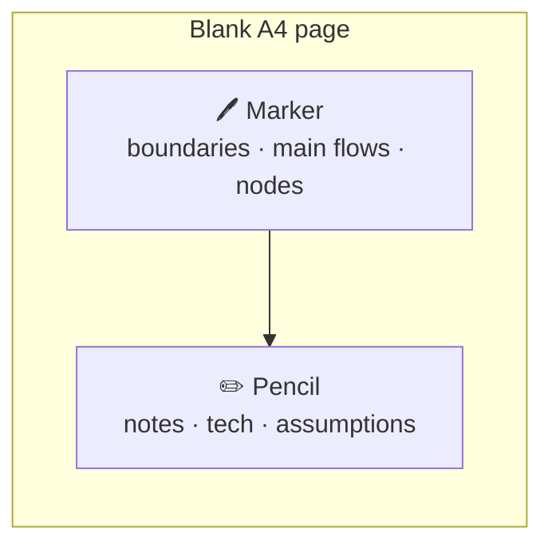
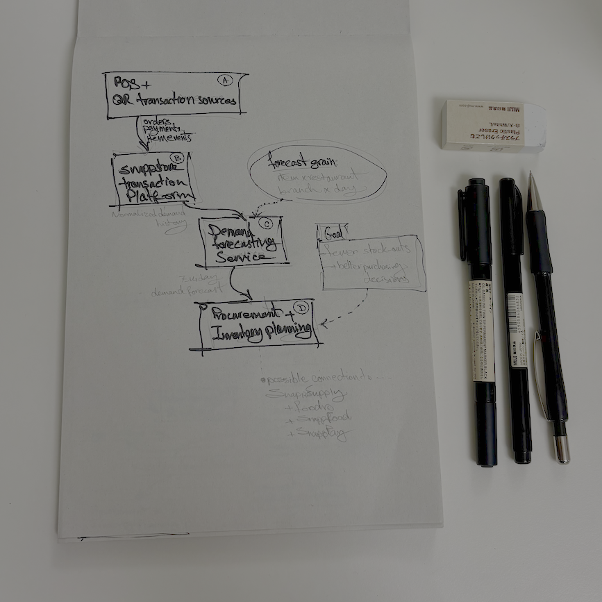
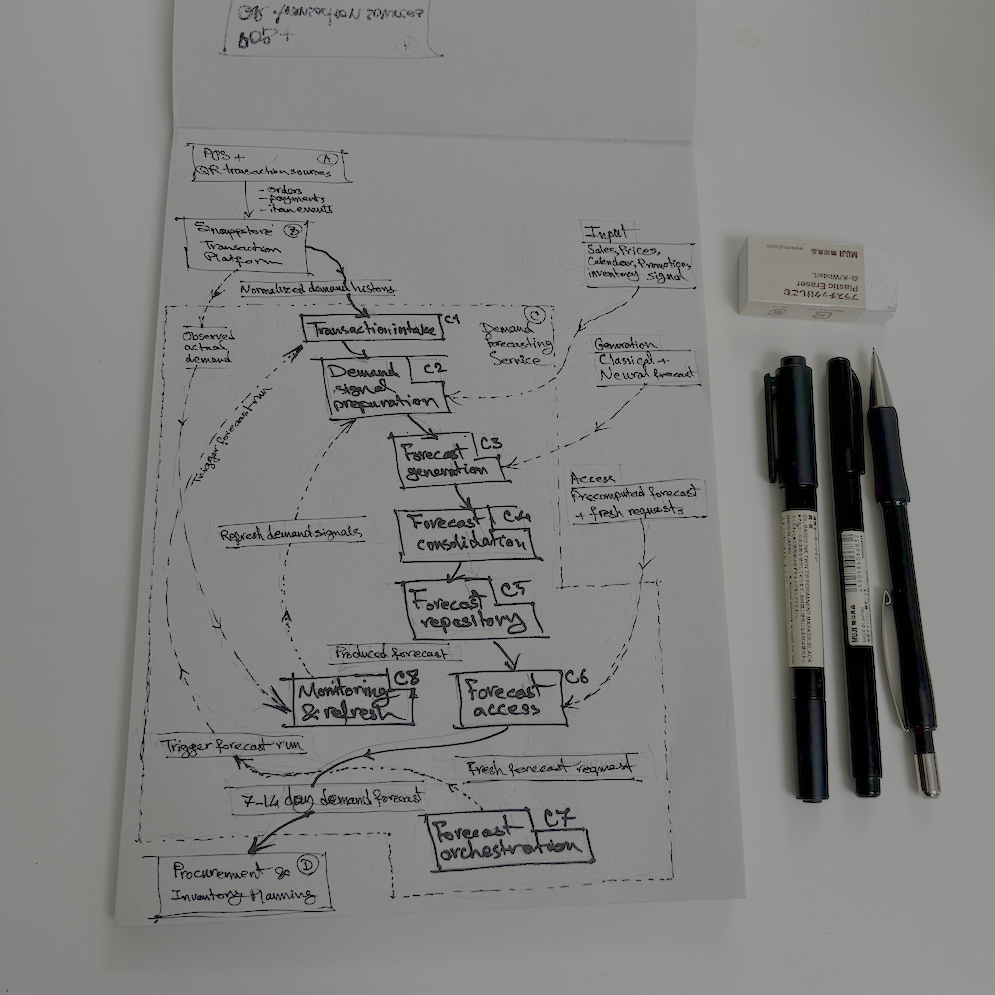
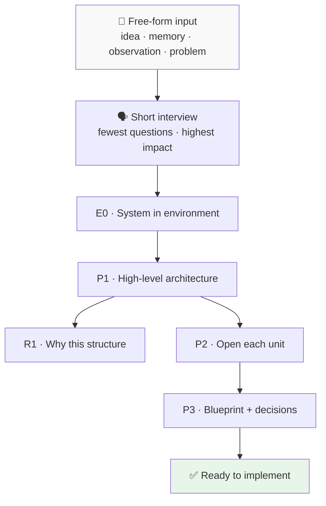

# Dream Print

**Vague idea, project memory, or technical problem → coherent architecture on paper**

Open-source Agent Skill · v0.1.3 · [MIT](dreamprint/LICENSE)

---

## Why?

You often have an idea that *feels right* but has no shape yet. Or a project you built before and want to reconstruct — without rethinking every step from scratch.

Dream Print helps you take what is scattered in your head and write it down **on large blank pages** — step by step, and **ready to implement**.

### The marker-and-pencil method on a blank page

Instead of filling one long document, each page has one job:



| Tool | Role | Why it matters |
|---|---|---|
| **Marker** | Architecture, system boundaries, main flows | Frees your mind from details — first answer *what talks to what* |
| **Pencil** | Grid, stack, assumptions, secondary flows | Adds detail without breaking the whole map |

This split means:
- **Boundaries become clear early** — before picking technology
- **Each page does one job** — not everything on one crowded diagram
- **Child pages never break the parent** — they only expand it
- **Output is printable and reviewable** — like a real design notebook

### From the notebook

Real etudes from the author's design notebook — marker for the backbone, pencil for opening one unit.

<table>
  <tr>
    <td align="center" width="50%">
      
      <br /><sub><strong>P1</strong> — POS/QR → Platform → Forecasting → Procurement</sub>
    </td>
    <td align="center" width="50%">
      
      <br /><sub><strong>P2</strong> — Inside the forecasting service (C1–C8, focus boundary)</sub>
    </td>
  </tr>
</table>

---

## Methodology — from dream to blueprint

Input can be anything: a sudden idea, a work observation, a forgotten project, or a technical problem.



| Page | In one sentence |
|---|---|
| **E0** | One system + its environment — no internal details |
| **P1** | Backbone: A, B, C, D and data flow |
| **R1** | Why these boundaries — no raw chain-of-thought |
| **P2** | Each P1 unit on one page with a focus boundary |
| **P3** | One-page blueprint + confirmed / default / open |

Output: **Mermaid directly in chat** — no file, HTML, or PDF required.

---

## Install

Clone once, then install the inner **`dreamprint/`** folder (contains `SKILL.md`):

```bash
git clone https://github.com/kvmmn/dreamprint.git && cd dreamprint
export SKILL_SRC="$(pwd)/dreamprint"
```

**Full guide:** [dreamprint/INSTALL.md](dreamprint/INSTALL.md)

| Tool | Global | Project (this repo) |
|---|---|---|
| **Cursor** | `~/.cursor/skills/dreamprint/` | `.cursor/skills/dreamprint/` |
| **Claude Code** | `~/.claude/skills/dreamprint/` | `.claude/skills/dreamprint/` |
| **Codex** | `~/.codex/skills/dreamprint/` | `.codex/skills/dreamprint/` |
| **Antigravity** | `~/.gemini/config/skills/dreamprint/` | `.agents/skills/dreamprint/` |
| **Windsurf** | `~/.codeium/windsurf/skills/dreamprint/` | `.windsurf/skills/dreamprint/` |
| **Copilot / VS Code** | — | `.github/skills/dreamprint/` |

**Antigravity** also accepts `.agent/skills/` (legacy) and `~/.gemini/antigravity/skills/` on some builds — see [INSTALL.md](dreamprint/INSTALL.md).

```bash
# Example: global install for Cursor + Antigravity
ln -sfn "$SKILL_SRC" ~/.cursor/skills/dreamprint
mkdir -p ~/.gemini/config/skills && ln -sfn "$SKILL_SRC" ~/.gemini/config/skills/dreamprint
```

Install all tools at once: run the script in [INSTALL.md § Install everywhere](dreamprint/INSTALL.md#install-everywhere-symlink-script).

After install, open a **new chat** (or reload the workspace) so the skill is discovered.

---

## Use

The skill **always interviews first** — even when your docs look complete. It shows a Readiness summary; you confirm; then pages appear.

```
Use Dream Print on this idea: a service that ...
```

```
Reconstruct this past project with Dream Print — readiness gate first.
```

```
/dreamprint
```

Default page size: **A4 Portrait**. Say another size if you want one.

---

## Repo layout

```text
dreamprint/          ← Installable skill (SKILL.md + references)
docs/                ← Design docs and decision history
assets/              ← Notebook etudes and visuals
README.md            ← This file
```

---

## Contribute

Issues and PRs welcome. **v0.1.3** — strict turn protocol (scan → interview → readiness → proceed → pages). [INSTALL.md](dreamprint/INSTALL.md) · sync: `bash dreamprint/scripts/sync-install.sh`

[Design docs](docs/index.md) · [Sync policy](docs/09-sync-policy.md) · [MIT License](dreamprint/LICENSE)
