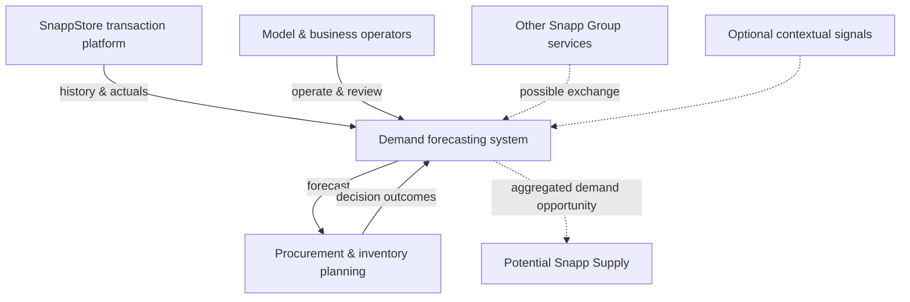
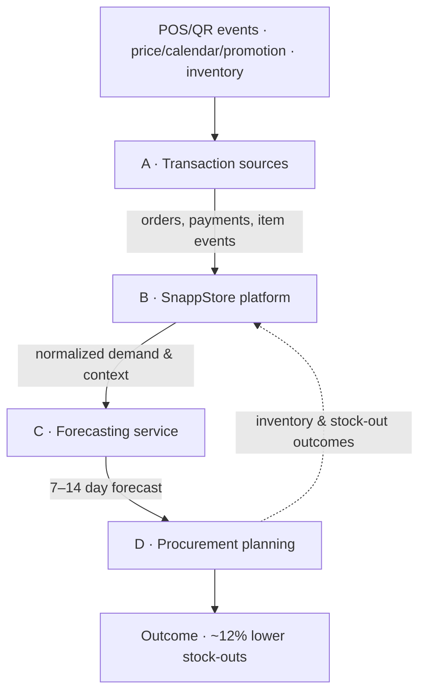
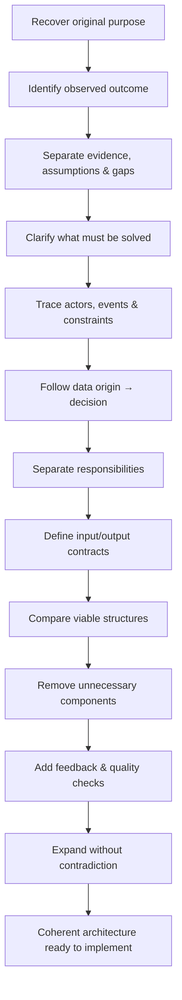
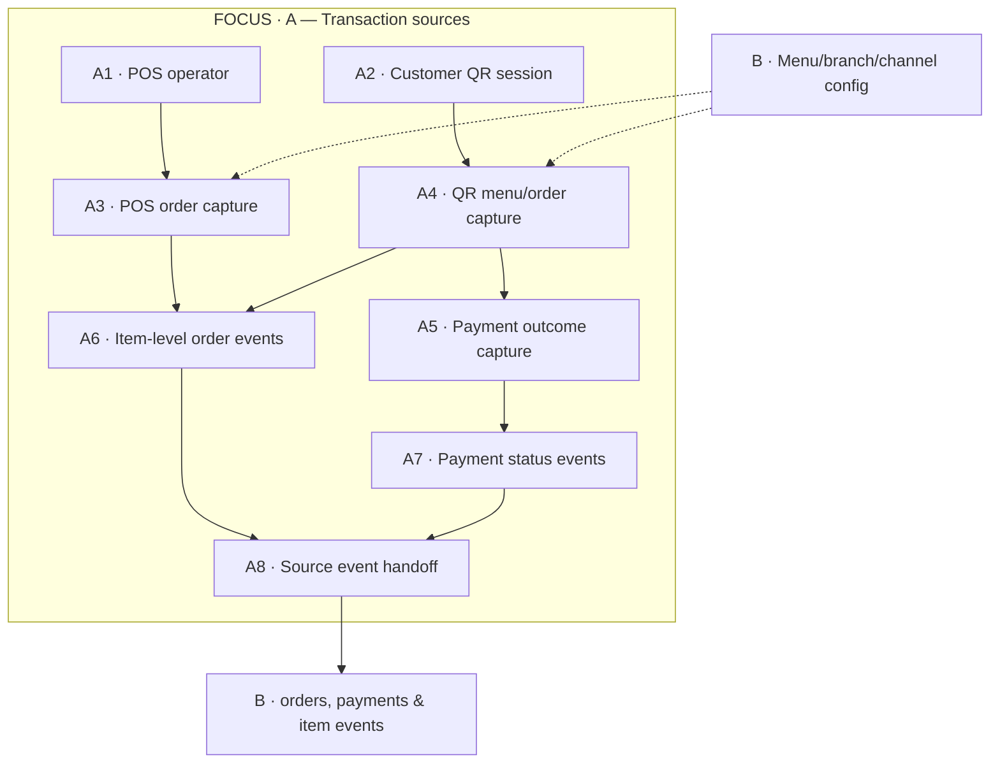
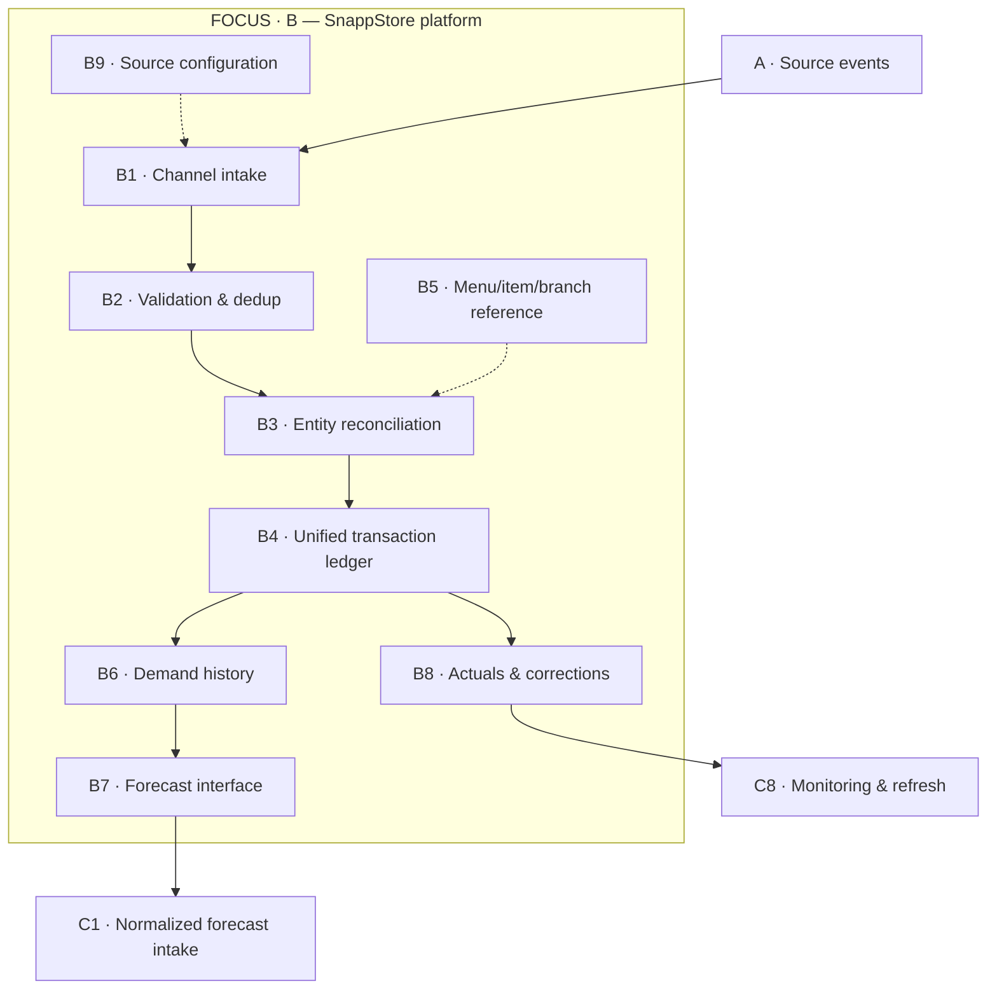
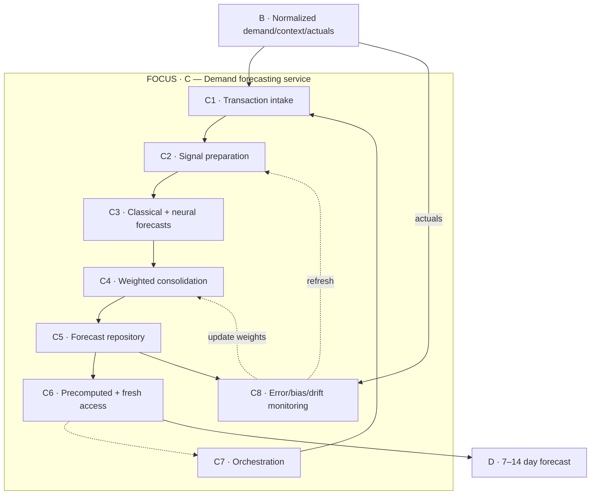
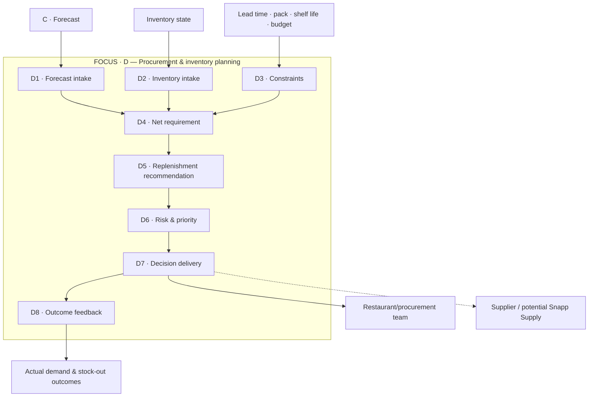
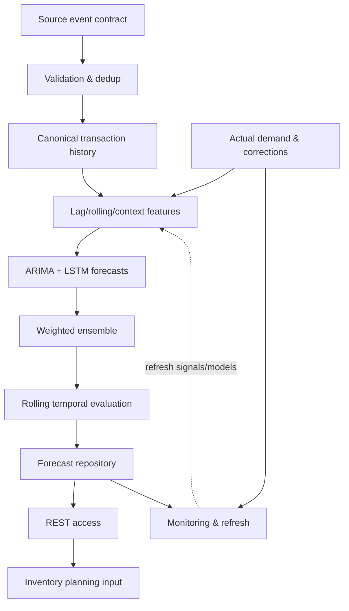

# SnappStore fixture (quality reference)

Proven forecasting project ready to be reconstructed. Use this as the acceptance shape, not as forced content for other projects.

## Context

- Role: Data Scientist (part-time), Nov 2023–Sep 2024
- Hybrid ARIMA + LSTM demand forecasting for procurement/inventory
- ~12% lower stock-outs
- Stack: Python · SQL · Statsmodels · TensorFlow · FastAPI · Docker · Kubernetes · Git
- SnappStore = B2B restaurant / omnichannel commerce platform
- Physical origin: restaurant POS + table QR; Platform owns transaction truth
- Forecasting never reads raw POS/QR; consumes normalized history/context/actuals
- Forecast ≠ purchase decision; Snapp Supply is optional/potential

## Pages (semantic models)

### E0

### P1

### R1

Title: **A proven forecasting project ready to be reconstructed**

### P2-A

### P2-B

### P2-C

Grain: item × branch × day. Target columns: `3+3+3+3`.

### P2-D

Net need ≈ forecast + safety stock − available. Forecast ≠ PO.

### P3

- Confirmed: sources, grain, horizon, hybrid serving
- Defaults: daily scoring, temporal backtesting
- Open: inventory source, stock-out label, supplier integration

## Lineage check

| Parent | Page | In | Out |
|---|---|---|---|
| A | P2-A | POS/QR interactions | orders/payments/item events |
| B | P2-B | source events | normalized demand/context/actuals |
| C | P2-C | normalized history/context | 7–14 day forecast |
| D | P2-D | forecast/inventory/constraints | recommendation/outcomes |
